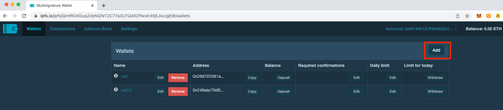
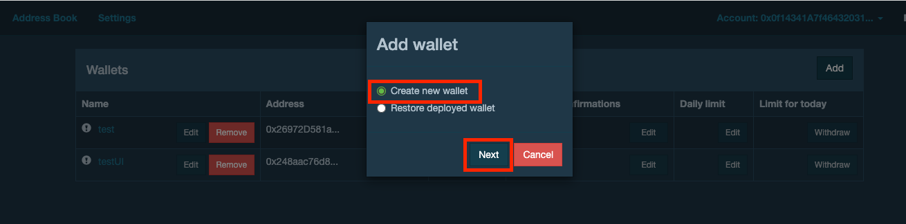
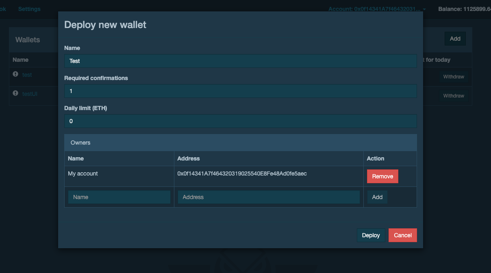
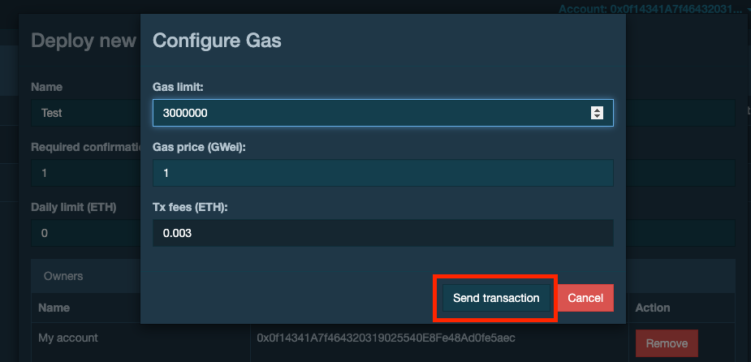
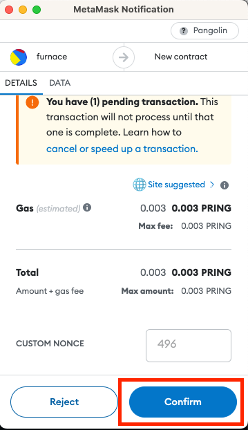
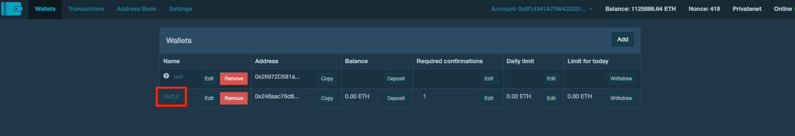
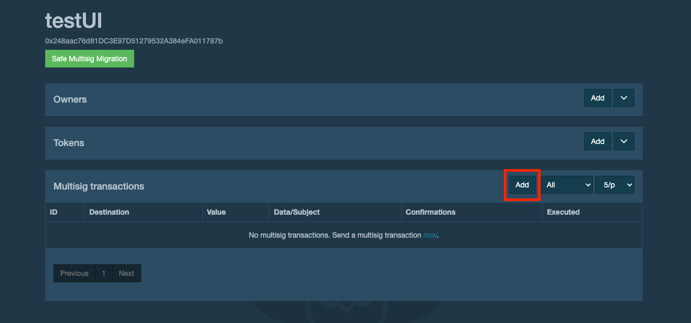
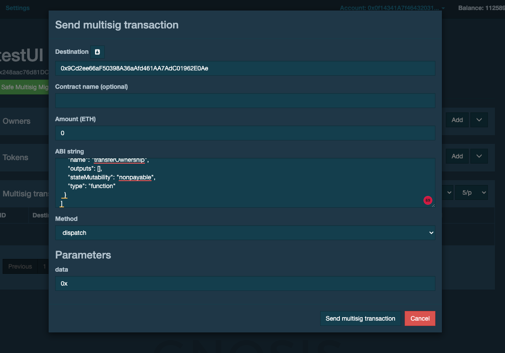
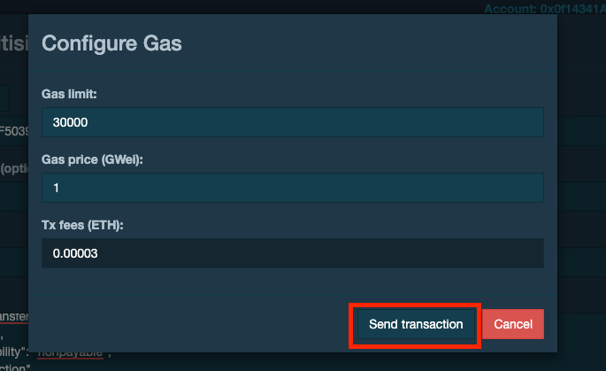
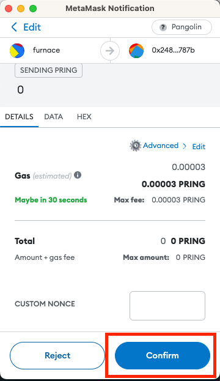

# Guide To Using The Gnosis MultiSig Wallet Interact With Root Contract
In this guide, you would deply your own multisignature wallet by [Gnosis MultiSigWallet](https://github.com/gnosis/MultiSigWallet) and interact with root contract. Let's take the Pangolin network as an example, you can switch to any other network
## Requirement
* [Panoglin Network](https://docs.darwinia.network/pangolin-testnet-9d65d6d810f4446abb60fa4580c94b3a)
* MetaMask
* [Native Token](https://docs.darwinia.network/testnet-faucets-de3bb5f3480142ce8dd77d8bec7260fe) in Panoglin Network
* [Root Contract](https://github.com/darwinia-network/darwinia-messages-sol/pull/319/files)

## Connected to Metamask
1. Navigate to `https://ipfs.io/ipfs/QmfRD4GuqZobNi2NT2C77a3UTQ452ffwstr4fjEJixUgjf`.
2. It will be connected to Metamask when open gonsis.
3. Check whether it is in Panoglin Test network . If not in Panoglin Test network, Change to `Panoglin Test network` on MetaMask.

## Deploy a new multi-sign wallet
1. Click `Add` on the right side of Wallet.

2. Click `Create new wallet` and `Next`.

3. Enter `Name`, `Required confirmations`, `Daily limit (ETH)` and the addresses of the owners and then `Deploy`:
* Name : Wallet name.
* Required confirmations : The number of approvals needed from the owners of the multisignature wallet.
* Daily limit (ETH) : A daily withdrawn limit.
* ADD: These are the owner addresses acting as a signatory for changes to the wallet, notably withdrawals, confirmation changes, daily limits, and ownership changes.

4. Click `Send Transaction` to deploy MultiSig Wallet but it will need Ether to pay gas fee. You should be greeted with a `Deployment transaction was sent` message on the top right corner.

5. Click `Confirm` in MetaMask popup.

That didn’t take long. Once the transaction was confirmed, we can see the wallet showing up on the Wallets tab. Please check whether your transaction is successful if wallet did not show up.

## Interact with root contract to call dispatch precompile
1. Click `Name` of wallet enter to the wallet detail page.

2. Click `Add` on the right side of MultiSig transactions.

3. Enter `Destination`, `Amount (ETH)`, `ABI string`, `Method` and then `Send multisig transaction`:
* Destination: root contract address.
* Amount (ETH): value is the dispatch call needed.
* ABI string: root contract ABI string.
* Method: select dispatch function.
  - data: the scalec encoded dispatch call data.

4. Click `Send Transaction` to create multisig transaction.

5. Click `Confirm` in MetaMask popup.

6. The second owner click `Confirm` under `Confirmations` and then click `Send transaction`. 

P.S You could click `Revoke Confirmation` to revoke the confirmed transaction. `Revoke confirmation` is only shown by owner who invoke transaction.

7. Customise the Gas limit and Gas price (GWei) and click on `Send transaction`.

8. Click `CONFIRM` in MetaMask popup.

9. All users who sign the transaction will be listed under Confirmations When transaction is confirmed.

10. When all required owners confirm the multisig transaction. the transaction will be executed.
P.S If all required owners confimed the multisig transaction. but the transaction executed status is false. any owner could click `execute` to re-execute the multisig transaction.
